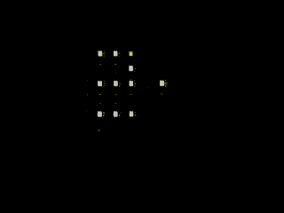

# e-HAL 2016 Badge

Repositório do crachá ('badge') para o ["1o Encontro Brasileiro de Hardware
Aberto e Livre"](https://ehal.org.br)(e-HAL).

O crachá do evento foi baseado no projeto de hardware aberto "FSM-55" (Flying
Stone Matrix Go! Go!) cujas placas foram doadas para o e-HAL pela empresa
**Flying Stone Tech** do Japão.

Para maiores informações sobre o FSM-55, visite a sua [página
oficial](http://wiki.seeedstudio.com/wiki/FSM-55). Para obter os arquivos de
design do crachá, acesse diretamente o [repositório oficial da Flying Stone
Tech](http://git.gniibe.org/gitweb/?p=fsm-55.git).

Para obter o código fonte e os arquivos de exemplo do FSM-55, clone o
repositório oficinal do projeto:

``` 
git clone git://git.gniibe.org/chopstx/chopstx.git 
```

## Compilando o firmware

Você pode utilizar o firmware do 'ehal' precompilado `ehal.elf` na pasta
`firmware` ou compilar um novo com base nas instruções abaixo.

Para compilar um novo firmware, é necessário configurar o seu sistema para
cross-compilação `ARM-Cortex-M0` (target: 'stm32f0x.cpu'). É possível baixar o
pacote pre-compilado do `gcc-4.6` ou `4.8` da sua distribuição ou baixar o
tarball com o toolchain completo através do site do projeto [GNU ARM Embedded
Toolchain](https://launchpad.net/gcc-arm-embedded). No Debian, o pacote
pré-compilado do chama-se ''gcc-arm-none-eabi''.

Após a instalação, assegure-se de que o compilador está no PATH re-exportando a
variável de ambiente. Exemplo:

``` 
export PATH="$PATH:/usr/src/gcc-arm-none-eabi-4_8-2014q3/bin/" 
```

Depois de configurado o ambiente de compilação cruzada, é preciso clonar o
repositório com o codigo-fonte do RTOS do FSM-55 (chopstix) e copiar os
arquivos `ehal.c` e `Makefile` para o diretório `chopstx/example-fsm-55`. Após
realizar a cópia, basta rodar `make` e o firmware será gerado no diretório
`build`.


## Re-programando o FSM-55

Após a compilação do firmware, é necessário reprogramar o FSM-55. Existem
atualmente 2 interfaces compatíveis:

### FT2232H:

Esta opção utiliza o chip FT2232H (USB-para-serial) e está documentada no site 
[All About Circuits](http://www.allaboutcircuits.com/technical-articles/getting-started-with-openocd-using-ft2232h-adapter-for-swd-debugging/).

### STLink v2:

Esta é a opcão mais fácil, mas ela requer a utilizacão de um programador com
firmware proprietário. 

Para utilizar o STLink v2, basta ligar o conector "CN3" do STLink com o
conector K3 do FSM-55:

* Coloque um jumper no conector CN3 do pino 1 (VAPP) para o pino 19 (VDD). Para
  referencia completa da pinagem, [acesse o manual do STLink
v2](http://www.st.com/content/ccc/resource/technical/document/user_manual/65/e0/44/72/9e/34/41/8d/DM00026748.pdf/files/DM00026748.pdf/jcr:content/translations/en.DM00026748.pdf).

```
- K3 (1) ---> CN3 (2)  VDD (3.3v)
- K3 (2) ---> CN3 (7)  SW IO 
- K3 (3) ---> CN3 (9)  SW CLK
- K3 (4) ---> CN3 (15) NRST (reset)
- K3 (5) ---> CN3 (20) GND (ground) 
```

Após conectar o programador e o FSM-55, conecte o STLink na USB e digite o
seguinte comando para programar o firmware:

``` 
sudo openocd -f stlink-v2.cfg -c "program build/ehal.elf; reset run;
shutdown" 
```

A saída do programa anunciará que o firmware foi escrito com sucesso:

``` 
** Programming Started ** 
auto erase enabled Info : device id = 0x10006444
Info : flash size = 16kbytes target state: halted target halted due to
breakpoint, current mode: Thread xPSR: 0x61000000 pc: 0x2000003a msp:
0x200004e0 wrote 4096 bytes from file build/ehal.elf in 0.473004s (8.457 KiB/s)
** Programming Finished ** 
in procedure 'reset' 
in procedure 'ocd_bouncer' 
```


## Resultado

Após reprogramar o FSM-55,  ele deverá mostrar 'e-HAL' na matriz de LEDs 5x5
conforme o exemplo abaixo:




## Licença

O projeto FSM-55 de software livre e hardware aberto foi fabricado pela Seeed
Studio e projetado por Flying Stone Tech (tm). O projeto é de autoria de [NIIBE
Yutaka](http://www.gniibe.org/), cujo apoio incondicional ao desenvolvimento do
hardware e software livre serve de inspiração. Somos muito gratos pela doação
de crachás para e-HAL 2016 da empresa Flying Stone Tech.

OpenOCD é um projeto de sofware livre, cuja licença livre pode ser obtida no
diretório 'openocd-0.9.0_patched' no arquivo LICENSE. Para maiores informacoes,
acesse o [site oficial do projeto](http://openocd.org).


